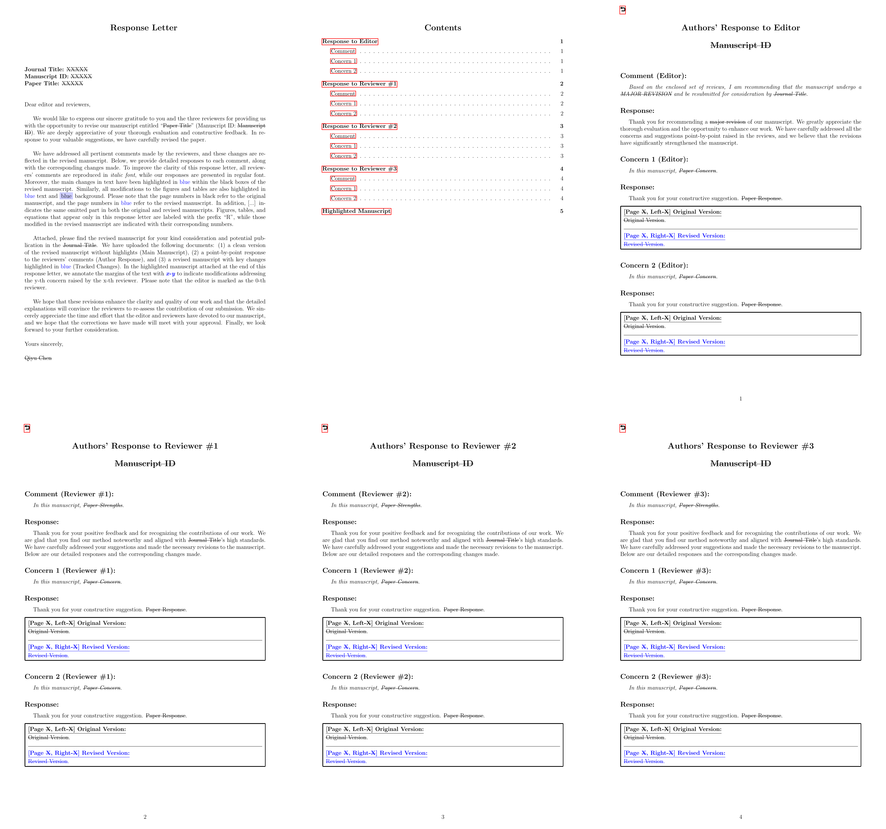

# Journal Response Letter Template

A clean and reusable LaTeX template for preparing journal **response letters** (also called **rebuttal letters** or **point-by-point response letters**) for manuscript revision.

This repository is intended for authors who want a simple English template to:
- reply to editors and reviewers,
- organize comments and responses clearly,
- highlight major revisions in a structured way.

## Preview

Below is a quick preview of the compiled PDF template.



## Features

- Clean cover page for journal title, manuscript ID, and paper title
- Separate sections for editor and multiple reviewers
- Consistent formatting for comments and author responses
- Simple and easy to customize
- Optional support for attaching a highlighted manuscript PDF at the end

## Repository Structure

```text
journal-response-letter-template/
├── main.tex
├── LICENSE
└── sec/
    ├── cover.tex
    ├── editor.tex
    ├── reviewer1.tex
    ├── reviewer2.tex
    └── reviewer3.tex
```

## Usage

1. Clone this repository.
2. Edit the metadata in `sec/cover.tex`.
3. Replace the example comments and responses in `sec/editor.tex` and `sec/reviewer*.tex`.
4. Compile `main.tex` with `pdflatex` or `xelatex`.

## Optional

If you want to append a highlighted manuscript PDF to the response letter, place the file in the repository and uncomment the corresponding lines in `main.tex`.

## Notes

- This template is designed for sharing and reuse.
- Please remove any journal-specific, manuscript-specific, or personal information before publishing your own version.
- You may further adapt the wording and formatting to match the target journal's requirements.

## Citation

If this template helps your workflow, a GitHub star or attribution in your own repository is appreciated.

```bibtex
@misc{journal_response_letter_template_2026,
  title        = {Journal Response Letter Template},
  author       = {Qiyu Chen},
  year         = {2026},
  howpublished = {GitHub repository},
  url          = {https://github.com/cqylunlun/journal-response-letter-template}
}
```

## License

This project is released under the MIT License.
